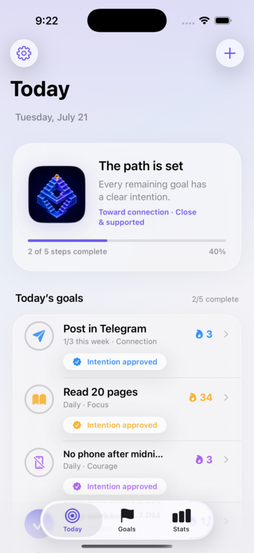
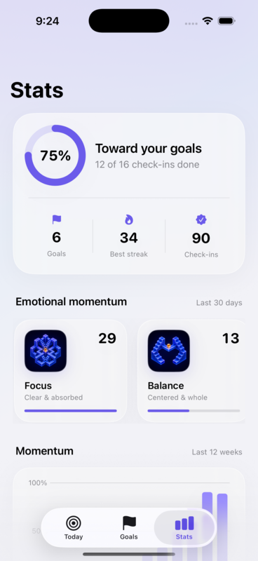
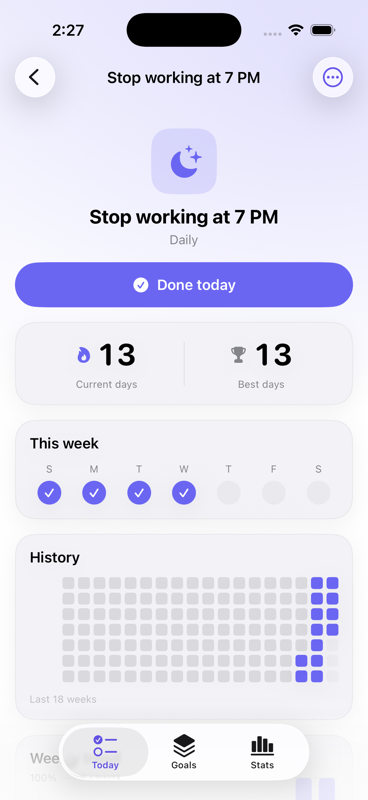
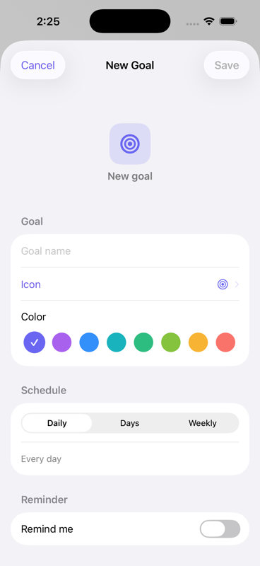
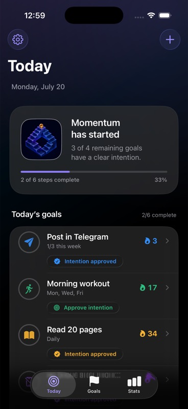
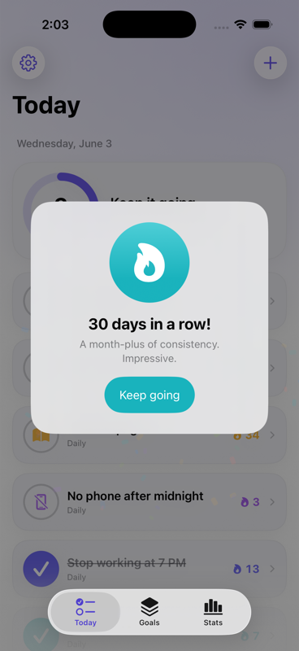

# WaiGoals

A minimal, native iOS app for tracking the goals and habits that matter — *“stop working at 7 PM”*, *“post in Telegram”*, *“read 20 pages”* — one tap a day. Built with SwiftUI + SwiftData for **iOS 26**, embracing the **Liquid Glass** design language.

> Track every day or every week, watch your streaks grow, and see your progress at a glance — privately, on your device.

<p>
  
  
  
</p>
<p>
  
  
  
</p>

## Features

- **Flexible scheduling** — each goal repeats **daily**, on **specific weekdays** (e.g. Mon/Wed/Fri), or **N times per week**.
- **Daily intentions** — at the start of the day, approve a lightweight commitment statement for each pending goal before marking it complete.
- **One-tap completion** — a satisfying check with a spring animation and haptic feedback. The core action takes under a second.
- **Forgiving, schedule-aware streaks** — current **and** best streak. Only the days you’re actually due count, an unfinished *today* is grace (never a broken streak), and your best is never erased by a single miss.
- **Statistics** — a per-week completion ring, a GitHub-style **heatmap**, a 12-week **trend chart** (Swift Charts), completion rate, and a current-streak leaderboard.
- **Impossible artifacts** — eight Escher-inspired achievements for a first step, kept intentions, returning after a miss, meaningful streaks, 100 real actions, and exploring every emotional world.
- **Per-goal reminders** — local notifications at a time you choose; tapping one opens that goal.
- **Local-only & private** — everything lives on device via SwiftData. No account, no cloud, no tracking.
- **Polished by default** — full Dark Mode, Dynamic Type, VoiceOver labels, Reduce Motion / Reduce Transparency support, and 44pt touch targets throughout.

## Design

- **Liquid Glass** is reserved for the navigation layer (tab bar, nav bars, sheets) — exactly per Apple’s guidance — while content sits on clean, solid cards. A subtle accent wash behind everything gives the glass something to refract.
- **Minimal, not sterile** — generous whitespace, one signature accent per goal from a curated 8-color palette, rounded numerals for streaks, and motion that rewards rather than distracts.
- **Forgiving by philosophy** — habit research is clear that guilt is a poor motivator, so streaks bend instead of breaking and the tone stays encouraging.

## Architecture

Modern SwiftUI “MV”, with logic kept out of the views so it’s trivially testable:

- **Models** (`@Model`) — `Goal`, `Completion`, `Intention`, `AchievementUnlock`. Achievement progress remains derived from real history; the unlock record preserves earned ownership and prevents duplicate celebrations.
- **Logic** (pure value types, fully unit-tested) — `Schedule`, `Weekday`, `StreakCalculator`, `StatsCalculator`, `AchievementEngine`. No SwiftData or UI behavior inside the calculators — just dates in, progress out.
- **Services** — `NotificationScheduler` (`@Observable`, syncs reminders on every change), `NotificationCoordinator` (foreground presentation + tap routing), `SampleData`, `Haptics`.
- **Design System** — `Theme`, `AccentToken`, Escher world motion, and reusable progress, streak, completion, heatmap, and artifact components.
- **Features** — `Today`, `Goals` (+ detail, editor, heatmap, symbol picker), `Achievements`, `Stats`, `Settings`.

```
WaiGoals/
  App/            WaiGoalsApp.swift · RootView.swift
  Models/         Goal · Completion · Intention · AchievementUnlock · Schedule · Weekday · Goal+Actions
  Logic/          StreakCalculator · StatsCalculator · AchievementEngine
  Services/       NotificationScheduler · NotificationCoordinator · AppSettings · Haptics · SampleData · AppLaunch · ModelContext+Persistence
  DesignSystem/   Theme · AccentToken · Components
  Features/       Today · Goals · Achievements · Stats · Settings
WaiGoalsTests/    Schedule · Streak · Stats · Achievements · Consistency  (Swift Testing)
```

## Tech stack

Swift 6.2 · SwiftUI · SwiftData · Swift Charts · UserNotifications — **zero third-party dependencies** (no supply-chain or version risk). Targets iOS 26, built with Xcode 26.

## Build & run

The Xcode project is generated from `project.yml` with [XcodeGen](https://github.com/yonsm/XcodeGen) (it isn’t committed):

```bash
brew install xcodegen          # once
xcodegen generate              # produces WaiGoals.xcodeproj
open WaiGoals.xcodeproj         # then ⌘R, or:

xcodebuild -scheme WaiGoals -destination 'platform=iOS Simulator,name=iPhone 17 Pro' build
```

Launch arguments (development / screenshots): `-seedSampleData`, `-tab today|goals|stats`, `-open editor|settings|detail|milestone|achievement`.

## Testing

54 unit tests cover schedules, streaks, statistics, achievement consistency, comeback detection, durable ownership, week/timezone boundaries, and compiled artwork assets:

```bash
xcodebuild -scheme WaiGoals -destination 'platform=iOS Simulator,name=iPhone 17 Pro' test
```

## Roadmap

iCloud sync · a Home-Screen widget with App Intents · Siri Shortcuts · HealthKit auto-complete · “avoid” (negative) goals. The architecture leaves room for all of them.

---

`is.waiwai.goals` · Made with care.
